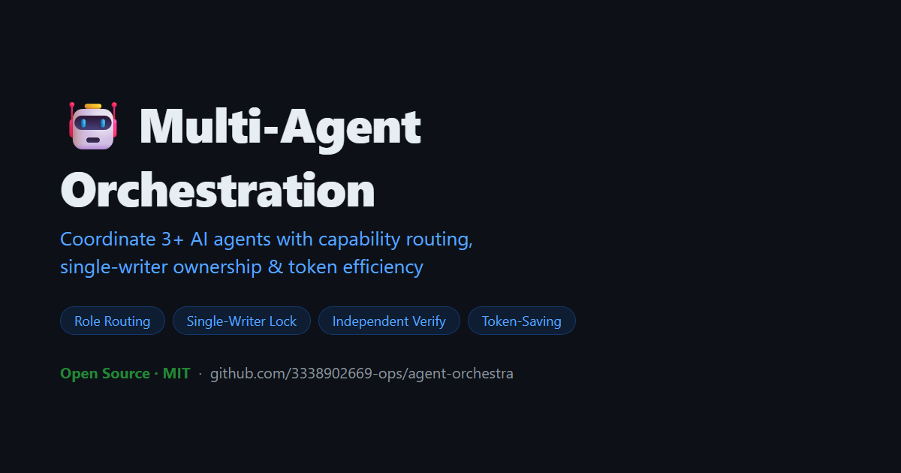

# Multi-Agent Orchestration Skill

A portable, capability-first protocol for coordinating three or more AI agents with explicit ownership, independent verification, risk-based execution, and token-aware routing.

## Features

- discovers capabilities instead of assuming agent names imply roles
- assigns coordinator, implementer, verifier, environment, and domain roles
- enforces one primary writer per file or resource
- adds a stronger pipeline for user-marked important or critical work
- stops on failed gates and requires evidence before completion claims
- reduces token and API cost with compact packets, bounded outputs, caching, parallel read-only checks, and model escalation

It does not provide an absolute guarantee; it makes failures visible, recoverable, and less likely.

## Install

Option A: one-click installer (auto-detects common skill dirs).

Windows PowerShell:

    powershell -ExecutionPolicy Bypass -File scripts/install.ps1

Linux/macOS shell:

    ./scripts/install.sh

Option B: clone and copy SKILL.md, references, and config into the skill directory supported by your host.

Validate your config locally:

    node scripts/validate-config.mjs

## Host adapter

Implement these five primitives: discover_agents, dispatch, lock, record, and approve. If a primitive is unavailable, use a documented manual fallback and record the limitation.

## Usage

This is important. Three agents are available. Assign the best implementation agent, have another independently test it, and do not deploy.

Expected: capability inventory, role assignment, task packet, ownership lock, implementation evidence, independent verification, acceptance report, and awaiting_user_approval for deployment.

## License

MIT.