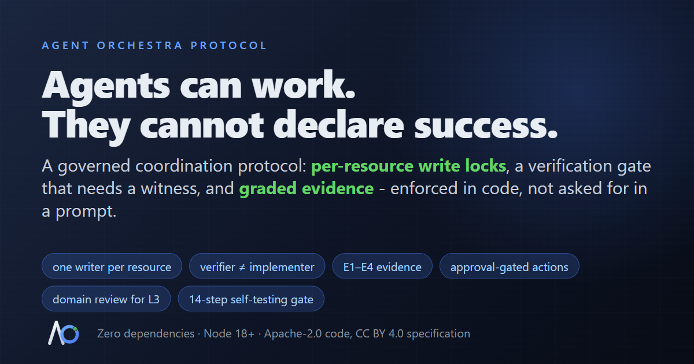

# Agent Orchestra Protocol

**A governed coordination protocol for multi-agent AI work.**

> Agents can work. **They cannot declare success.**

Every multi-agent project eventually meets the same failure: an agent says it is done, and nothing in
the system is able to disagree. This protocol removes that possibility by making the interesting rules
checks in code rather than requests in a prompt.

```
AGENT MAY                    AGENT MAY NOT
  claim work                   silently overwrite another agent's resource
  own resources                verify its own L2/L3 work
  implement                    pass verification without evidence
  hand off                     retry forever after failing
  verify others' work          perform an external action without approval
  produce graded evidence      declare success without satisfying the gate
```

### Measured, not asserted

`node bench/protocol-benchmark.mjs` - six failure modes, three coordination models, scripted actors,
no model calls. Re-run it and you get this table:

| Failure mode | What is counted | Single agent | Naive multi-agent | Agent Orchestra |
|---|---|---|---|---|
| Two agents write the same resource | conflicting writes that landed | 1 | 1 | **0** |
| Author declares done with no evidence | self-declared successes accepted | 1 | 1 | **0** |
| Implementer verifies its own work | self-verifications accepted | 1 | 1 | **0** |
| Verification keeps failing | attempts before the loop stops | 25 | 25 | **3** |
| Deploy attempted without approval | unapproved actions dispatched | 1 | 1 | **0** |
| Failure followed by a success claim | failures that reached done | 1 | 1 | **0** |

Scope, stated plainly: this measures the **coordination layer** - which failure modes get through - not
model quality, and it uses deterministic actors rather than LLMs so that it is reproducible. The
methodology and its limits are in [`bench/README.md`](bench/README.md).

### Conformance, audited

[**CONFORMANCE.md**](CONFORMANCE.md) maps every MUST in the protocol to the code that enforces it and
the test that pins it: **41 requirements, 38 ENFORCED, 1 DOCUMENTED ONLY, 2 OUT OF SCOPE**. The table is
machine-checked - a reference that does not resolve, or an ENFORCED row without a test, fails the gate.

### The normative part

[**AGENT-ORCHESTRA-PROTOCOL.md**](AGENT-ORCHESTRA-PROTOCOL.md) defines eight contracts - Task,
Resource, Ownership, Handoff, Verification, Evidence, Approval, Recovery - each with the code that
enforces it, the behaviour on violation, and its honest limit. The contracts are stated in terms of
operations and observed behaviour, not of this CLI, so another host can implement them over its own
storage and prove conformance with the same benchmark.

### What this costs you

Zero dependencies, Node 18+.** 99 engine tests, 8 acceptance tests, 8 handoff tests, 83 activation cases (a corpus driven by 8 acceptance checks), and one gate command (`node scripts/gate.mjs`) that CI and your machine both run - it injects
ten known faults and must reject every one of them before it reports PASS.

中文对照：`references/zh-contrast.md`

---

One portable, capability-first protocol for multi-agent work along **two axes**: coordinating a team inside one batch of tasks, and handing that work across sessions, tools and days without losing state. It ships explicit ownership, independent verification, graded evidence, deterministic dispatch, a shared handoff record and token-aware routing.

<p align="center"></p>

## What's in this repository

| Path | What it is | Read it when |
|---|---|---|
| `SKILL.md` (root) | The protocol: roles, ownership, verification gate, handoff record, queue, evidence, cost | you want the short form |
| `references/handoff.md` | Handoff discipline: the four shared records, the five iron rules, the task state machine, single-writer conflicts, memory sync, the cross-tool checklist | work is relayed across sessions or tools |
| `references/` | Detail: routing-and-roles, evidence-grading, task-queue, important-task-intake, protocol, anti-patterns, token-efficiency | you need the full rule, not the summary |
| `config/agents.example.yaml` | Activation, risk, roles, ownership, intake gate, roster, queue, verification gate, approval, evidence, cost | you are wiring the skill to your agents |
| `scripts/detect-trigger.mjs` | Keyword activation detector (exit 0 engaged / 1 not engaged) | keyword activation mode |
| `scripts/orchestrator/` | Task queue CLI + library + tests (zero dependencies, Node 18+) | you want deterministic dispatch and claim locks |
| `scripts/install.ps1`, `scripts/install.sh` | One-click installers that copy this single skill into a detected skills directory | first install |

## Features

- covers both axes in one skill: in-task coordination, and handoff across sessions and tools
- keeps a human-readable shared record - handoff entry, rules, memory snapshot, role table - as the authority when the queue and intent disagree
- five iron rules with executable checks: read before acting, resume instead of redoing, write progress down, hand off before switching, completion carries graded evidence
- a task state machine - `queued` / `in-progress` / `handoff-wait` / `done`, plus `blocked` only after three unresolved rounds - mapped to the queue's stage machine
- discovers capabilities instead of assuming an agent's name implies a role
- assigns coordinator, implementer, verifier, environment and domain roles by capability score
- enforces one primary writer per file or resource, with reviewers limited to isolated artifacts
- requires a verifier that is not the implementer: an author's self-check is never a verification result
- picks that verifier by **capability score from your roster**, excluding the implementer, and fails closed when nobody is scored for verification
- works with **any roster size and any agent names**: 3 agents, 8 or 12; routing comes from roster data, so adding an agent is a data edit, not a code change
- enforces a **verification gate**: a failed verify sends the task back to implement and it can neither reach done nor be dispatched to evidence until a verify passes or a human records an override with approver, scope and reason
- grades every claim E1 (reproducible) through E4 (planned), so self-assertion cannot pose as evidence
- asks the user three questions before an important task starts (solo vs collaborative, security scan, independent verification) and never defaults them
- **refuses a conflicting claim on the same resource**, naming the task and agent that hold it
- **requires a witness for every verification PASS** and stores it on the verification record, which is what keeps L3's
  "the verifier produced none of the evidence" from contradicting "verification needs evidence"
- **blocks a task after three failed verifications** until a coordinator recovers it, reading the ceiling from policy
  rather than hard-coding it
- **gates dispatch on approval, scope included**: an approval for staging does not unlock a production deploy
- **runs a domain review for consequential work** - a third agent who neither implemented nor verified it, with its own record
- adds a stronger pipeline for important and critical work: independent verification, domain review, and explicit approval for external actions
- runs a deterministic queue: `specify -> implement -> verify -> evidence -> done`, claim locks, dry-run dispatch, per-scope `approve` for deploy/publish/send/upload/delete
- refuses to disguise an undispatchable task as success (non-zero exit code)
- reduces token and API cost with compact packets, bounded outputs, model tiering, parallel read-only checks, and escalation only where ambiguity lives

It does not provide an absolute guarantee; it makes failures visible, recoverable, and less likely.

## Activation (when to use)

The skill engages in one of three modes, configured under `activation:` in `config/agents.example.yaml`:

- **global** - engages for every task
- **keyword** - engages only when the task text matches configured keywords (default; token-saving)
- **manual** - engages only when the user explicitly invokes it

For keyword mode, run the trigger detector before starting:

    node scripts/detect-trigger.mjs --text "<task text>" --config config/agents.example.yaml

Three answers, not two: **0** ENGAGED (a curated keyword plus an act of coordinating), **3** POSSIBLE (ambiguous - the
caller decides), **1** NOT_ENGAGED (silent). Comparison and evaluation requests never auto-engage, and the veto markers are
phrases rather than single characters, because a false veto silently drops a real request. `exclude_keywords` vetoes
engagement even when a trigger matched.

## The ten invariants

Each one is a check in the engine with a test behind it, not a sentence an agent is asked to respect.

| # | Invariant | Where it is enforced |
|---|---|---|
| I1 | **One owner per task** - a stage is held by exactly one agent at a time | `claimTask`, `requireOwner` |
| I2 | **One writer per RESOURCE** - a conflicting claim is refused and names the holder | `claimTask`, resource overlap check |
| I3 | **No implementer verifies its own L2/L3 work** - and an important task may not self-verify even at L1 | `completeStage` |
| I4 | **A verification PASS must carry its witness** | `completeStage` (verify) |
| I5 | **A failed verification blocks downstream** - no `done`, no dispatch to evidence | `failVerification`, `nextDispatch` |
| I6 | **Three failed rounds block the task** for a coordinator to recover | `failVerification` + `policy.maxVerificationAttempts` |
| I7 | **L2 and L3 need graded evidence** before `done` | `completeStage` (evidence) |
| I8 | **L3 needs E1 evidence and a verifier that produced none of it**, plus a domain review by a third party | `completeStage` (evidence, domain_review) |
| I9 | **An external action needs a matching approval** before dispatch | `nextDispatch` |
| I10 | **`done` requires every applicable gate to be satisfied** | the stage machine |

Two honest boundary markers, both written down as known findings rather than hidden: the queue is a plain JSON
ledger (a discipline, not a security boundary - F-011), and E1 checks that a command, its exit code and a revision are
recorded, not that the command ran (F-012).


1. One primary writer per file or resource at a time.
2. Verifier != implementer - and the verifier is the best-suited eligible agent by capability score, never a fixed name.
3. The verification gate cannot be walked past: no `done` and no `evidence` dispatch after a failure until a verify passes or an override with approver, scope and reason is recorded.
4. Read before acting, resume instead of redoing, and write progress down before switching.
5. No completion claim without criterion-linked evidence.
6. Irreversible and external actions need separate, explicit user approval (`approve`), which passing verification does not grant.
7. The human-readable shared record outranks the queue.
8. Consequential work is reviewed by someone in the domain who did none of the work.
9. Rigor is chosen from the blast radius, not from how interesting the task is.
10. Every rule here is either enforced or listed as an accepted limitation - nothing in between.

## Roster (any size)

Roles are assigned from a **roster**, which is data, not code. Three agents work; so do five, eight or twelve, and the agents can be called anything at all - nothing depends on an agent being named `coordinator` or `verifier`:

```yaml
agents:
  planner: { cost: 2, specialties: [],       scores: { specify: 3, implement: 1, verify: 1, evidence: 3 } }
  builder: { cost: 4, specialties: [full],   scores: { specify: 1, implement: 3, verify: 1, evidence: 1 } }
  webhand: { cost: 5, specialties: [web],    scores: { specify: 1, implement: 2, verify: 1, evidence: 1 } }
  auditor: { cost: 6, specialties: [verify], scores: { specify: 1, implement: 1, verify: 3, evidence: 2 } }
  scribe:  { cost: 1, specialties: [],       scores: { specify: 1, implement: 1, verify: 0, evidence: 3 } }
routes:                      # optional: anything omitted is resolved by score
  specify: planner
  evidence: scribe
  implement: { build: builder, web: webhand }
```

- Scores are 0-3 per role. Selection is deterministic and reproducible: **highest score -> capability match in `specialties` -> lower `cost` -> agent id order**. Setting `available: false` parks an agent without deleting it.
- Stage owners come from `routes` when the roster names one, otherwise from the score. A roster that can fill no agent for a stage is rejected loudly, never routed by accident.
- Install a roster of your own with `orchestrator.mjs init --roster <file.json>`. Adding an agent is a data edit: declare it, score it, it joins selection.

Full rules: `references/routing-and-roles.md`.

## Verification gate

Verification is a gate run by **an agent from your own team, chosen for the job** - no external tool and no particular vendor is required:

- the verifier is the highest-scoring eligible agent for `verify`, and the implementer is never eligible; if nobody is scored above 0, the run fails closed instead of pretending;
- completing the `verify` stage is a PASS; `fail` records the failing criteria and sends the task back to `implement`, and the verifier never fixes the work itself;
- the gate blocks two things: reaching `done` from `evidence`, and being dispatched to `evidence` at all;
- a human may override deliberately with `override --by <who> --scope <what> --reason <why>` - all three are required, and the failed result is kept beside the override rather than erased;
- a passed verification is not a shipping authorization.

Full rules: `references/task-queue.md`.

## Handoff record

When the work moves - another session, another tool, another day - the state moves through a shared record, not through chat history:

| File | Holds | Updated |
|---|---|---|
| `CURRENT-TASK.md` | the live handoff entry: status, owner, progress, next step, evidence | on every substantial step |
| `HANDOFF-RULES.md` | the team's rules of engagement | when rules change |
| `MEMORY-SNAPSHOT.md` | shared decisions, preferences, lessons | periodically / on big decisions |
| `AGENT-ROLES.md` | who can do what | when the roster changes |

The five iron rules, in order: **read before acting**, **resume instead of redoing**, **write progress down**, **hand off before switching**, **completion carries graded evidence**. A task waiting to be picked up is `handoff-wait`; a task stuck on a condition names that condition and is marked `blocked` only after three rounds.

Detail, including the cross-tool checklist and the memory sync routine: `references/handoff.md`.

## Task queue

    node scripts/orchestrator/orchestrator.mjs init --roster my-team.json          # any roster size, any names
    node scripts/orchestrator/orchestrator.mjs create   --title "Fix checkout" --type build --workspace "<workspace>"
    node scripts/orchestrator/orchestrator.mjs claim    --task task-0001 --agent implementer-a
    node scripts/orchestrator/orchestrator.mjs complete --task task-0001 --agent implementer-a --evidence "tests pass, exit 0"
    node scripts/orchestrator/orchestrator.mjs dispatch --task task-0001
    node scripts/orchestrator/orchestrator.mjs fail     --task task-0001 --agent verifier-b --criteria "test X fails"
    node scripts/orchestrator/orchestrator.mjs override --task task-0001 --by user --scope "release 2.1" --reason "pre-existing flake"
    node scripts/orchestrator/orchestrator.mjs approve  --task task-0002 --by user --scope "deploy to production"
    node scripts/orchestrator/orchestrator.mjs status

`dispatch` prints a dry-run command; it never starts an agent. `fail` closes the verification gate; `override` is the only way past it and needs approver, scope and reason. Run the tests with:

    node --test scripts/orchestrator/lib.test.mjs

## Install

**One repository, one skill.** Copy the contents of this repository into the skill directory your host supports - `SKILL.md`, `references/`, `config/`, and `scripts/` if you want the queue. There is no companion package and no second skill to install.

Optionally, the one-click installers perform the same single-skill copy into common skill directories.

Windows PowerShell:

    powershell -ExecutionPolicy Bypass -File scripts/install.ps1

Linux/macOS shell:

    ./scripts/install.sh

Validate your config locally:

    node scripts/validate-config.mjs

## Host adapter

Implement these five primitives: `discover_agents`, `dispatch`, `lock`, `record`, and `approve`. If a primitive is unavailable, use a documented manual fallback and record the limitation.

## Usage

This is important. Three agents are available. Assign the best implementation agent, have another independently test it, and do not deploy.

Expected: capability inventory, role assignment, task packet, intake-gate answers, ownership lock, implementation evidence, independent verification with graded evidence, acceptance report, and `awaiting_user_approval` for deployment.

## Checking this repository

One command, and it is the same command CI runs:

```bash
node scripts/gate.mjs            # evidence lands in evidence/latest.json
node scripts/gate.mjs --no-self-test   # skip the gate's own failure test (not recommended)
```

The runner checks that the shipped config is usable by the engine, that activation engages on
intent and stays silent on lookalikes, that the queue engine and the CLI I/O behave, that the
handoff record discipline holds, that the numbers stated in these docs match the suites, and that
no private path, secret or host-specific name ships.

A shared handoff record can also be checked on its own, which is what the skill asks a successor to
trust before resuming:

```bash
node scripts/check-handoff.mjs --dir <shared-record-dir>
```

It requires the four record files, a live entry carrying status, owner, current step, next step and
evidence, a recognised status value, and the statement that the record outranks the queue. It writes a machine-readable record
bound to the git revision and to the SHA-256 of the key artifacts.

It also **proves it can fail**: before reporting PASS it injects known-bad configurations and
requires every one to be rejected. A gate that has quietly stopped checking anything therefore
fails instead of reporting green - see [`references/verification-standard.md`](references/verification-standard.md)
for the requirements it is held to, and [`KNOWN-FINDINGS.md`](KNOWN-FINDINGS.md) for accepted
defects and their review dates.

## License

Apache-2.0 for the code (with the patent grant that a protocol implementer needs), CC BY 4.0 for
the protocol specification. See LICENSE, NOTICE and LICENSE-SPEC.
